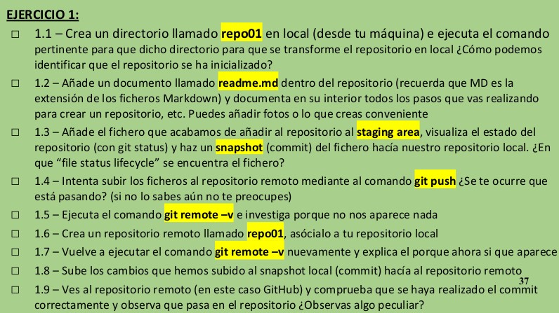
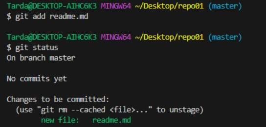
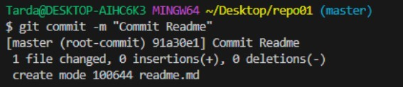
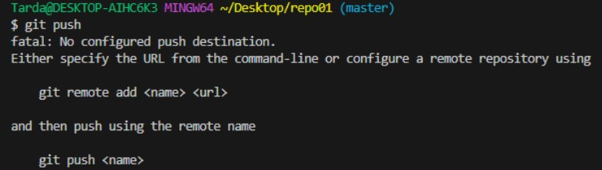
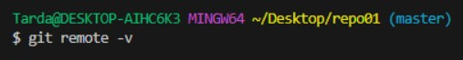
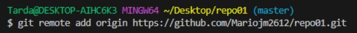
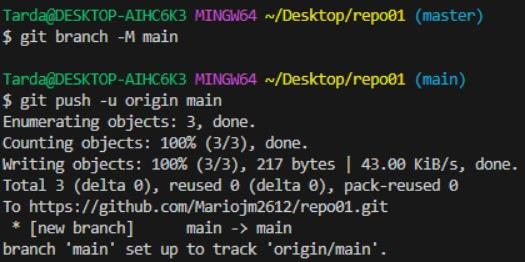
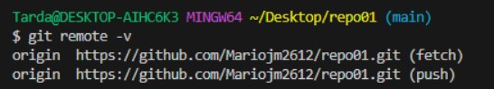
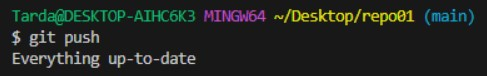
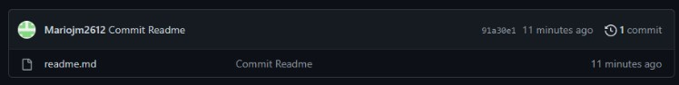

1.1 ➡ Creamos el directorio local con el nombre de "repo01".

1.2 ➡ Creamos el readme.md dentro del repositorio.  
 

1.3 ➡ Añadimos el fichero al staging area y visualizamos el estado.

  
Y ahora hacemos commit del fichero.
  
  
Una vez hecho esto se encuentra en el repositorio local, preparado para enviarlo al repositorio remoto (GitHub).

1.4 ➡ Intentamos hacer push de los ficheros.

  

Aún no podemos, esto es debido a que aún no hemos conectado el repositorio local con el remoto.

1.5 ➡ Ejecutamos el comando "git remote -v".  

  

No aparece nada porque aún no tenemos ningún repositorio remoto asociado.

1.6 ➡ Creamos un repositorio remoto llamado "repo01" en GitHub y lo asociamos usando los comandos que nos proporciona la web.

  

   

1.7 ➡ Volvemos a ejecutar el comando "git remote -v" y ahora si que podemos ver el repositorio remoto al que estamos asociados.

 

1.8 ➡ Finalmente hacemos un push y subimos los cambios al repositorio remoto (Ya los subimos previamente con los comandos de asociamiento por lo que recibimos un comentario de que los archivos ya están actualizados) . 

  

1.9 ➡ Personalmente no observo nada peculiar.

  

